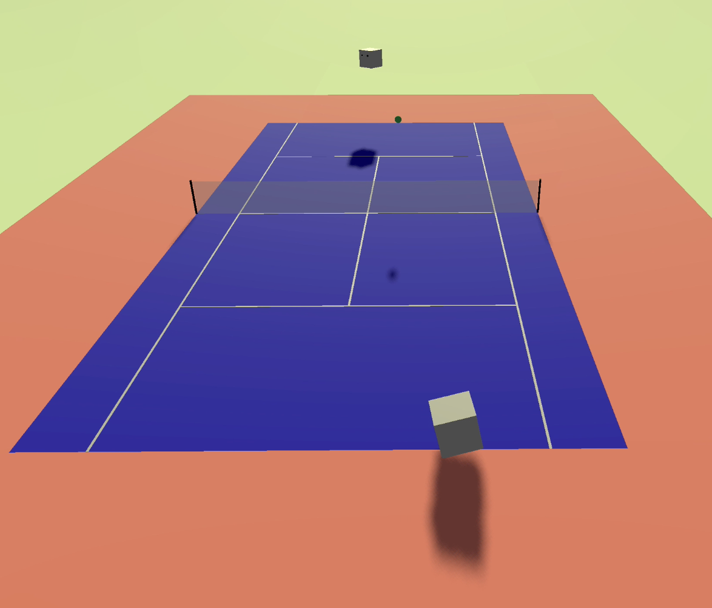

  

<h1 align="center">Tennis Simulator</h1>

  3D tennis simulator built entirely in Godot.

  
  

---

## About The Project

3D tennis simulator built entirely in Godot. Two white blocks (representing players) play tennis against one another with hard-coded state-based logic.

### Implemented Mechanics

The project correctly implements these following mechanics:

- Players can enter a rally, including serve, return, and hit the ball back and forth.
- Players can hit ball differently based on their current playstyle (aggressive, defensive, neutral).
- Players can pick up ball and restart the rally once a point is over.

---

## Preview

  

---

## How To Run

Project runs on **Godot 4.4**.

1. Install Godot 4.4  
2. Download the `Tennis AI` folder  
3. Import it as a project inside the Godot engine  

---

## Roadmap

- [x] Add player movement and rotation.
- [x] Add court boundaries and make players move to specific targets.
- [x] Add serve state to player.
- [x] Add return state to player.
- [x] Add rally state to player.
- [x] Allow players to restart the rally on their own.

### Still In Progress

- [ ] Make players hit the ball more consistently
- [ ] Add a scoring system, and track which player wins a point
- [ ] Simulate a full tennis match from beginning to end
